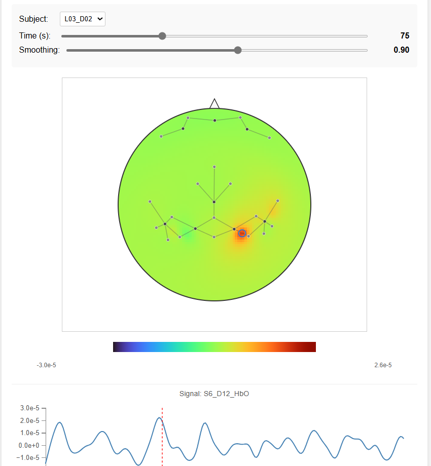

# Interactive fNIRS Topography Viewer

This tool processes trial-based fNIRS data for multiple subjects, performs optional Hemodynamic Trigger Averaging (HTA), and generates interactive, self-contained HTML visualizations using D3.js. The visualizations feature a topographic heatmap interpolated in 3D space and projected onto a 2D view, along with clickable channels to display individual time series.

 
*(Suggestion: Replace placeholder.png with an actual screenshot of your visualization)*

## Features

*   **Interactive Topographic Heatmap:** Visualizes fNIRS activation across the scalp.
*   **3D Interpolation:** Performs Inverse Distance Weighting (IDW) interpolation based on 3D channel midpoint coordinates for greater accuracy.
*   **2D Projection:** Uses Azimuthal Equidistant projection to map the 3D scalp surface onto a 2D plane for visualization.
*   **Subject Selection:** Easily switch between different subjects within the same trial using a dropdown menu.
*   **Time Navigation:** A slider allows stepping through time points (downsampled data) or HTA segments.
*   **Smoothing Control:** Adjust the smoothing factor for the spatial interpolation in real-time.
*   **Subject-Specific Scaling:** Color scale is automatically adjusted based on the overall min/max range of the selected subject's data for that trial.
*   **Clickable Channels:** Click on channel midpoints on the topography to view the corresponding time series signal in a separate plot below.
*   **Optional HTA Averaging:** Can process data by averaging signal segments based on event markers provided in an external Excel file.
*   **Handles Missing HTA Data:** Can be configured to skip subjects if required HTA data is missing.
*   **Multi-Chromophore Processing:** Can process specified chromophores (e.g., HbO, HbR) and generate separate visualizations for each.
*   **Self-Contained Output:** Generates individual HTML files for each trial/chromophore combination, embedding all necessary data and code.

## Requirements

*   **Python 3.x**
*   **Python Libraries:**
    *   `pandas`: For data manipulation and reading CSV/Excel files.
    *   `numpy`: For numerical operations (vectors, means, etc.).
    *   `openpyxl`: Required by pandas to read `.xlsx` files (for HTA).
    *   You can usually install these using pip:
        ```bash
        pip install pandas numpy openpyxl
        ```
*   **Web Browser:** A modern web browser supporting HTML5, CSS3, and JavaScript (tested with D3.js v7).

## Data Format Requirements

The script expects specific file formats and naming conventions:

### 1. Signal Data (`.txt` files)

*   **Location:** All `.txt` files for the trials you want to process should reside in a single directory, specified by the `data_directory` variable in the Python script.
*   **Naming Convention:** Files must be named using the pattern `SubjectID_TrialNum.txt`.
    *   `SubjectID`: A unique identifier for the subject (e.g., `LC01_D01`, `Subject05`). Can contain letters, numbers, underscores.
    *   `TrialNum`: The trial number, represented as digits (e.g., `01`, `4`, `12`).
    *   Example: `LC01_D01_04.txt`, `Pilot02_1.txt`
*   **Format:** Comma-Separated Values (CSV).
*   **Header:** The first row **must** be a header row containing column names.
*   **Columns:**
    *   Must include columns for the fNIRS channels you want to visualize.
    *   Channel column names **must** follow the pattern `S<SourceNum>_D<DetectorNum>_<Chromophore>` (e.g., `S1_D5_HbO`, `S8_D12_HbR`).
    *   The script currently filters out short-separation channels by excluding detectors D16-D24 (hardcoded in `prepare_trial_visualization_data`). Modify this if your SS channel naming differs.
    *   Ensure the `SourceNum` and `DetectorNum` correspond to names present in the `digpts.txt` file.
    *   Other columns in the file are ignored.

### 2. Digitizer Data (`digpts.txt`)

*   **Location:** The path to this file is specified by the `digpts_file` variable in the Python script.
*   **Format:** Plain text file. Each line defines the 3D coordinates of a point.
*   **Line Format:** `Name: X Y Z`
    *   `Name`: The identifier for the point (e.g., `S1`, `D5`, `Cz`, `Nz`). **Must match** the source/detector names used in the `.txt` file headers (`S<Num>`, `D<Num>`).
    *   `X`, `Y`, `Z`: The 3D coordinates (space or tab-separated floating-point numbers).
    *   Example Lines:
        ```
        S1: 85.37 -15.01 41.53
        D5: 70.12 -25.88 60.90
        Nz: 0.05 92.11 -6.34
        LPA: -85.00 0.00 0.00
        ```
    *   The script uses these coordinates to calculate channel midpoints, the head center, and perform 3D interpolation.
    *   The 'Nz' point is used to draw the nose indicator on the 2D topography.

### 3. HTA Data (`.xlsx` - Optional)

*   **Required only if:** The `DO_HTA_AVERAGING` flag in the Python script is set to `True`.
*   **Location:** Path specified by the `HTA_FILE_PATH` variable.
*   **Format:** Excel spreadsheet (`.xlsx`).
*   **Sheet Name:** The specific sheet containing the data is defined by `HTA_SHEET_NAME`.
*   **Columns:**
    *   The sheet must contain columns where the header **exactly matches** the expected subject identifier *after* being processed by the `HTACOL_RENAME_FN` lambda function in the script's configuration.
    *   By default, `HTACOL_RENAME_FN = lambda x: x.replace("_", "")` means if your `.txt` file is `LC01_D01_04.txt`, the script looks for an HTA column named `LC01D01`. Adjust the lambda function if your mapping is different.
*   **Content:**
    *   Each relevant subject column should contain a list of event timestamps (in seconds) relative to the start of the recording session for that subject.
    *   Timestamps define the *start* of segments to be averaged. The average is calculated between one timestamp and the next.
    *   Empty cells or cells with non-numeric data (`NaN`) are ignored.
    *   At least two valid timestamps are required per subject to create at least one segment for averaging.
*   **Trial Filtering (Important):** The script currently contains logic (`if trial_num != HTA_TRIALNUM: continue` when `DO_HTA_AVERAGING` is True) that **filters processing to only the trial specified by `HTA_TRIALNUM`**. If you want to process multiple trials using HTA data (and your HTA file supports this), you may need to comment out or remove this filtering check in the main processing loop of the Python script. Alternatively, prepare separate HTA files per trial and adjust `HTA_TRIALNUM` accordingly when running the script.

## Configuration

Key parameters need to be set in the main execution block (`if __name__ == "__main__":`) of the Python script (`your_script_name.py`):

*   `folder`: Name used in the output directory name.
*   `data_directory`: Path to the folder containing your `.txt` signal files.
*   `digpts_file`: Path to your `digpts.txt` file.
*   `template_html`: Path to the provided `template.html` file.
*   `output_visualization_dir`: Base name for the directory where HTML files will be saved (e.g., `visualizations_MyExperiment`). Will be appended with `_HTA` if HTA is enabled.
*   `DO_HTA_AVERAGING`: Set to `True` to enable HTA processing, `False` to use standard downsampling.
*   `HTA_FILE_PATH`: Path to the HTA Excel file (used only if `DO_HTA_AVERAGING` is `True`).
*   `HTA_SHEET_NAME`: Name of the sheet in the HTA Excel file.
*   `HTA_TRIALNUM`: The specific trial number to process when HTA is enabled (due to the current filtering logic).
*   `HTACOL_RENAME_FN`: A lambda function to map the `SubjectID` from `.txt` filenames to the corresponding column header in the HTA Excel file.
*   `srate`: The original sampling rate (in Hz) of the data in the `.txt` files.
*   `downsample_rate`: The integer factor by which to downsample the data if HTA is not used (e.g., `5` means keep every 5th sample). `dsfreq` is calculated from this and `srate`.
*   `chromophores_to_process`: A list of strings specifying which chromophores to process (e.g., `["HbO", "HbR"]`). A separate HTML file will be generated for each.

## How to Run

1.  **Clone Repository:** Get the code and template file.
    ```bash
    git clone <your-repo-url>
    cd <your-repo-directory>
    ```
2.  **Install Dependencies:**
    ```bash
    pip install pandas numpy openpyxl
    ```
3.  **Prepare Data:** Ensure your `.txt`, `digpts.txt`, and (if using) `.xlsx` files are formatted correctly and placed appropriately.
4.  **Configure Script:** Edit the configuration variables in the main Python script (`your_script_name.py`) to match your file paths, data parameters, and desired processing options (HTA, downsampling, etc.).
5.  **Run Script:**
    ```bash
    python your_script_name.py
    ```
6.  **View Output:** Open the generated `.html` files (located in the `output_visualization_dir`) in your web browser.

## Output

The script generates self-contained HTML files in the specified output directory.

*   **Naming:** `fnirs_viewer_Trial<Num>_<Chromo>.html` (e.g., `fnirs_viewer_Trial04_HbO.html`).
*   **Content:** Each HTML file contains the interactive visualization for one trial and one chromophore, embedding all necessary data and JavaScript code.


## Limitations and Assumptions

While this tool is designed to be flexible, users should be aware of the following limitations and underlying assumptions:

*   **Montage Flexibility:** The visualization is **not** strictly tied to a specific montage (e.g., 10-10, 10-20). Its accuracy depends entirely on the correctness and completeness of the 3D coordinates provided in the `digpts.txt` file for all sources and detectors used in the signal data files. Any custom montage can be visualized as long as accurate 3D coordinates are supplied.
*   **Coordinate System Consistency:** The script assumes a consistent 3D Cartesian coordinate system is used in `digpts.txt`. The quality and orientation of the 2D projection depend on this consistency. The Azimuthal Equidistant projection math works best when the Z-axis generally points "up" from the scalp vertex, resulting in a standard top-down view. Non-standard coordinate system orientations in `digpts.txt` might lead to unusual projection views.
*   **Head Model Approximation:** The 3D interpolation uses an *average* head radius calculated from the 3D channel midpoints and projects data onto an idealized sphere of this radius for interpolation. This is an approximation and does not account for individual head shape variations or use a detailed anatomical model (like an MRI). Accuracy may be reduced for highly non-spherical head shapes or montages covering anatomically complex regions (e.g., near the neck or face).
*   **Strict Naming Conventions:** The script relies heavily on exact naming conventions:
    *   **Signal Files:** `SubjectID_TrialNum.txt`
    *   **Channel Headers:** `S<SourceNum>_D<DetectorNum>_<Chromophore>` (must match `<SourceNum>`/`<DetectorNum>` names in `digpts.txt`).
    *   Deviations from these formats will cause the script to fail or ignore data.
*   **HTA Data Format:** If using HTA, the Excel file structure, sheet name, and column headers (after applying `HTACOL_RENAME_FN`) must precisely match the script's expectations. The current HTA implementation averages between consecutive timestamps provided for a subject.
*   **Short-Separation Channel Handling:** The script currently excludes detectors D16-D24 by default, assuming they are short-separation channels based on a specific hardware convention. If your SS channels are named differently, or if you wish to include them in the standard channel visualization, the filtering logic within the `prepare_trial_visualization_data` function needs to be modified.
*   **Data Preprocessing:** This tool focuses on visualization. It assumes the input signal data (`.txt` files) has already undergone necessary preprocessing steps (e.g., filtering, motion correction, conversion to concentration changes) appropriate for the analysis. The script does not perform these steps itself (aside from the optional HTA averaging).
*   **Performance:** While optimized for interactivity, extremely large datasets (e.g., very long trials processed via downsampling instead of HTA, massive numbers of channels, or hundreds of subjects per trial) could potentially impact browser performance, particularly during the initial 3D grid calculation or when rendering very long time series plots.

In summary, the tool generalizes well to different fNIRS montages provided accurate 3D coordinates, but requires strict adherence to file/data formatting and makes simplifying assumptions about head geometry for 3D interpolation.


## Citation

If you use this visualization tool in your research or publications, please cite it as follows:

CeMSIM (2025). Interactive fNIRS Topography Viewer (Version [v1.1.1]). GitHub Repository. [Link](https://github.com/axiom5/fNIRS_topoviewer/)

## License

MIT License